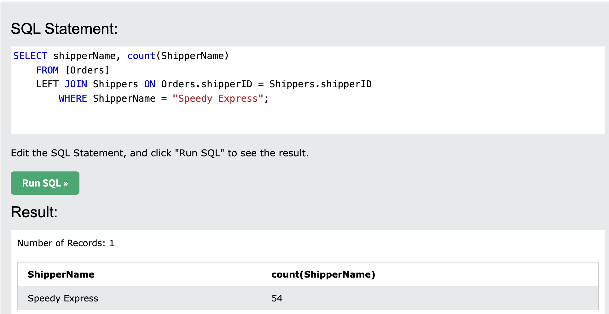
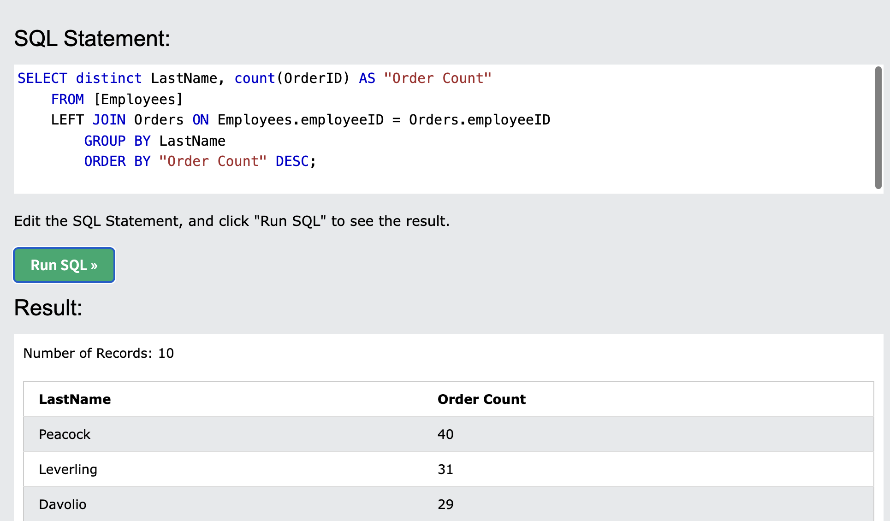
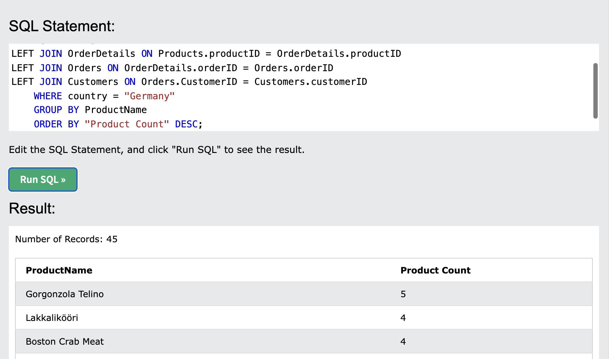

# Shopify_Internship
Summer 2022 Data Science Intern Challenge

*The following ReadMe responds to the questions asked within the Shpify Internship Challenge*.

Question 1: Given some sample data, write a program to answer the following: click here to access the required data set

On Shopify, we have exactly 100 sneaker shops, and each of these shops sells only one model of shoe. We want to do some analysis of the average order value (AOV). When we look at orders data over a 30 day window, we naively calculate an AOV of $3145.13. Given that we know these shops are selling sneakers, a relatively affordable item, something seems wrong with our analysis. 

Think about what could be going wrong with our calculation. Think about a better way to evaluate this data. 

## Question 1: 

### What metric would you report for this dataset? 

- The AOV has outlier orders that are abnormally high, hereby skewing the average order value to a value that is much higher than it should be. These outliers must be removed in order to obtain a more likely AOV. 

### What is its value?
- Once the outliers of orders consisting of 2000 items are removed, our revenue changes from $15,725,640 to 3,757,640 and our AOC changes from $3,145.13 to $754.09.

- Before adjustment of AOC:

- After adjustment of AOC:

## Question 2: 
For this question you’ll need to use SQL. Follow this link to access the data set required for the challenge. Please use queries to answer the following questions. Paste your queries along with your final numerical answers below.

- a. How many orders were shipped by Speedy Express in total? 
  - Answer: 54

  
    
    SELECT shipperName, count(ShipperName)  
    FROM [Orders] 
    LEFT JOIN Shippers ON Orders.shipperID = Shippers.shipperID 
        WHERE ShipperName = "Speedy Express";

- b. What is the last name of the employee with the most orders? 
  - Answer: Peacock with 40 orders

  

    SELECT distinct LastName, count(OrderID) AS "Order Count" 
    FROM [Employees] 
    LEFT JOIN Orders ON Employees.employeeID = Orders.employeeID 
        GROUP BY LastName 
        ORDER BY "Order Count" DESC;

- c. What product was ordered the most by customers in Germany? 
  - Answer: Gorgonzola Telino with 5 orders

  - 

  - 

SELECT ProductName, count(ProductName) AS "Product Count" 
FROM [Products] 
LEFT JOIN OrderDetails ON Products.productID = OrderDetails.productID 
LEFT JOIN Orders ON OrderDetails.orderID = Orders.orderID 
LEFT JOIN Customers ON Orders.CustomerID = Customers.customerID 
    WHERE country = "Germany" 
    GROUP BY ProductName 
    ORDER BY "Product Count" DESC; --Insert "Limit 1" after Desc (to show one answer)
